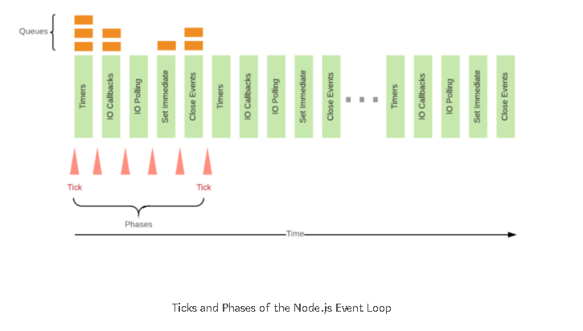
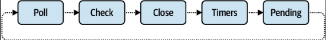

### How Node.js works

Node.js is JS run time, outside of the browser

#### Libuv

* Node.js is c++ application that has v8 embedded into it
* Like Mysql
  * Files uploads from client
  * Save logs onto file

*  Scaling  - Millians of requests
*  Ability to handle network requests

* Libuv is handling behind the scenes
* Libuv is C library
* Libuv provides mechanism to handle file system, DNS, network, child processes, pipes, signal handling, polling, and 
  streaming. Non blocking ability

* Top - What are the processes that are opened on computer
* CPU, memory, disk. Network - Num of bytes send, num of bytes received
* Network card allows you to connect to internet (or diff computers connected together using ethernet cable)
* Node.js = V8 + LibUV + zlib + openSSL

### Event Loop
The event loop as a process is a set of phases with specific tasks that are processed in a round-robin manner.

  ```js
    console.log("first")
    for (let i=0; i < 10000000; i++) {
      // hashing a string
    }
    console.log("second")
  ```

* My app will be blocked until it reaches "second"
* So whole app becomes unresponsive

```js
  console.log("first")

  require('fs').readFile('filePath/a.txt', (err, data) => {

  })
  console.log("third") //  <--
```
readFile will go to event loop
from event loop it will go to libuv -> OS -> SSD
SSD -> libuv -> proccessing -> event loop -> V8 will execute the callback

Above is called event driven programming

```
  console.log("A")
  setTimeout(() => console.log("B"), 0)
  console.log("C")
  console.log("D")
```

* V8 and event loop are running in single thread 

* PDF viwer exmaple for multiple threading

### Thread Pool
- In libuv we have 4 threads by default. But we can increase it using a flag.
- Netwrok req are not done using thread pool
- Network card -> Req -> OS -> Libuv -> Event Loop => V8
- Threads are useful when Dealing with files
- Node.js tries to minimize the use of threads, that makes it incredibly scalable


### Phases Overview
* timers: this phase executes callbacks scheduled by setTimeout() and setInterval().
pending callbacks: executes I/O callbacks deferred to the next loop iteration.
* idle, prepare: only used internally.
* poll: retrieve new I/O events; execute I/O related callbacks (almost all with the exception of close callbacks, the ones scheduled by timers, and setImmediate()); node will block here when appropriate.
* check: setImmediate() callbacks are invoked here.
* close callbacks: some close callbacks, e.g. socket.on('close', ...).


### process.nextTick()

* Ticks are phases in event loop
* In simple terms, process.NextTick() would executed at next tick of event loop.





```js
process.nextTick(() => {
  console.log("B")
})
```

* Execute it when the main part of the program is executed
* It is not used, becz it may block the event loop

### setImmediate()

The setImmediate, has a separate phase which ensures that the callback registered under setImmediate() will be called only after the IO callback and polling phase.

Callbacks scheduled with setImmediate() are executed at the end of the current event loop iteration, specifically in the "check" phase. This means that all I/O operations and timers scheduled in the current iteration will complete before the setImmediate() callbacks are executed


### References
https://medium.com/the-node-js-collection/what-you-should-know-to-really-understand-the-node-js-event-loop-and-its-metrics-c4907b19da4c

https://stackoverflow.com/questions/15349733/setimmediate-vs-nexttick

https://nodejs.org/en/learn/asynchronous-work/event-loop-timers-and-nexttick


### Child Process
* A child process in Node.js is a separate instance of the V8 engine that runs independently from the main Node.js process. This allows you to execute additional Node.js scripts or other programs from within a Node.js application.


* child process is an independent operating system process that is spawned to execute tasks outside the main Node.js application. This allows developers to handle CPU-intensive or I/O-intensive operations without blocking the event loop, which is crucial for maintaining the responsiveness of Node.js applications.

```js
const { fork } = require('child_process');
```

This allows execution of:-
* system commands
* running scripts
* performing other operations in parallel to the main process. 


`fork():` A specialized version of `spawn()` used specifically to create new Node.js processes. It establishes a communication channel between the parent and child processes, allowing them to send messages to each other.

#### Use Cases for Child Processes
Child processes are particularly useful in scenarios where:

1) Heavy Computation: Tasks that require significant CPU resources can be offloaded to child processes, preventing the main event loop from being blocked.

2) Running External Commands: When there is a need to execute shell commands or scripts that are not part of the Node.js application.

3) Parallel Execution: Multiple child processes can be spawned to perform tasks concurrently, improving application performance.

In summary, child processes in Node.js provide a powerful way to manage tasks that would otherwise hinder the performance of a single-threaded application. 


### CPU Intensive VS I/O intensive
